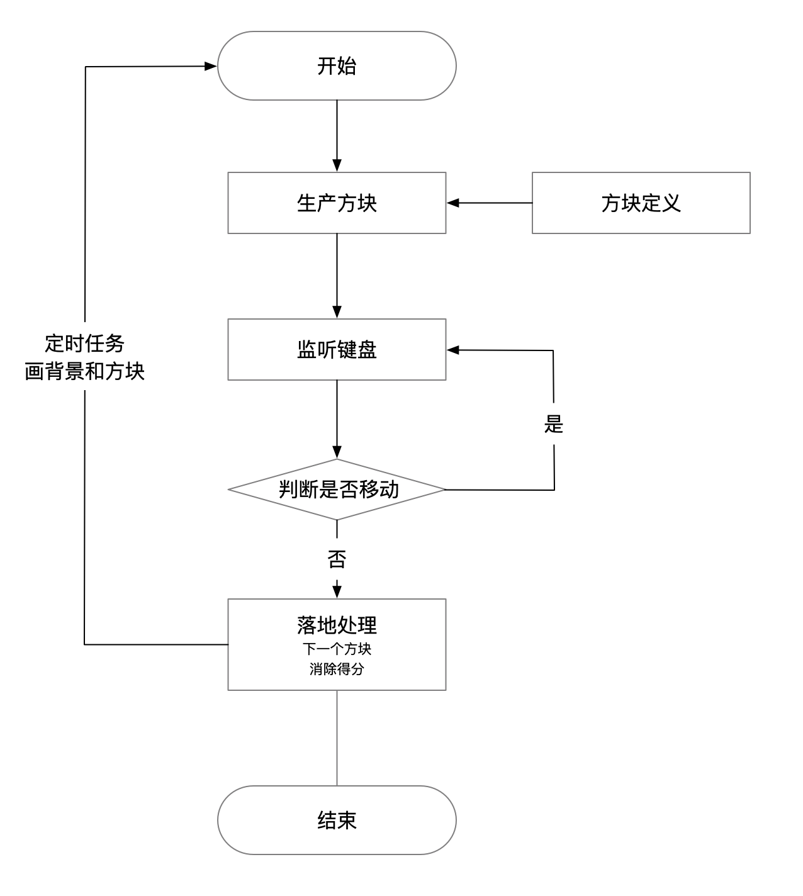
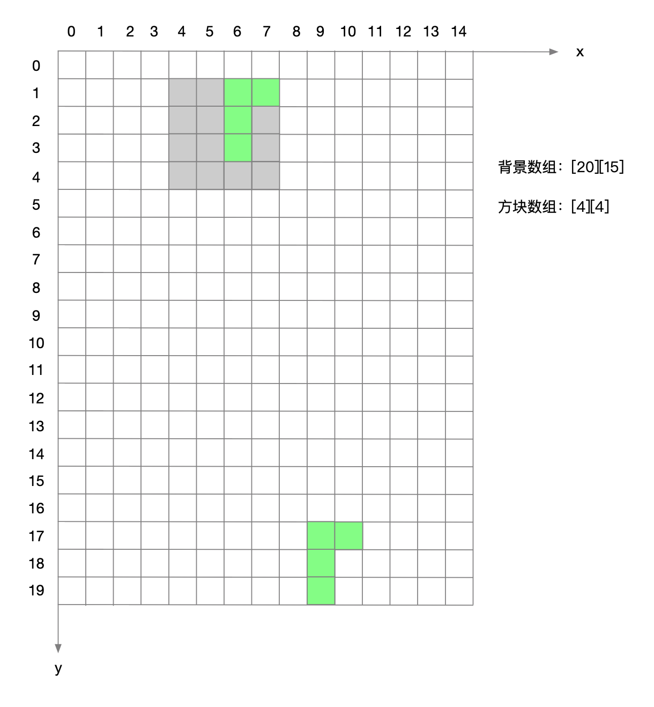
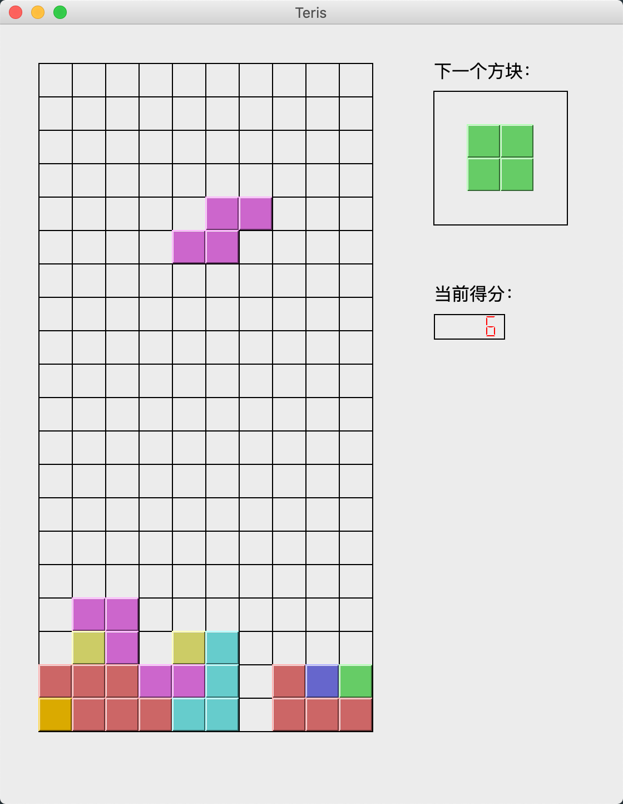

使用python做一个简单的游戏，感觉可以联系一下基本语法。下面介绍一下如何使用Python PtQt5制作一个俄罗斯方块。

先设计一下基本的流程，分别介绍每个流程所需要开发的代码：




### 开始

设置一个定时任务，循环画背景，当前方块、下一个方块。

生产出当前方块和下一个方块。

使用QBasicTimer开启一个timer，设置时间间隔，则会根据时间间隔回调`timerEvent`方法。

```
self.timer = QBasicTimer()

self.timer.start(1000, self)

def timerEvent(self, event):
    if event.timerId() == self.timer.timerId():
        self.downHandler()
    else:
        super(QWidget, self).timerEvent(event)
```


### 方块生产

首先我们要定义方块和背景的构建。

背景：采用二维数组的方式构建背景，有方块的地方则为非0，没有方块的地方则为0，然后循环这个二维数组进画图。

方块：采用一个四维数组7 * 4 * 4 * 4，第一维是7个形状（长条形状、方块形状），第二维是每个形状有4个方向，三四维度一起看做一个4*4的二维数组，存储方块的具体数据。有方块的地方则为非0，没有方块的地方则为0，然后循环这个二维数组可以画出形状。




### 键盘监听

监听键盘的上下左右

```
def keyPressEvent(self, event):
    key = event.key()
    if key == Qt.Key_Left:
        self.leftHandler()
    elif key == Qt.Key_Right:
        self.rightHandler()
    elif key == Qt.Key_Down:
        self.downHandler()
    elif key == Qt.Key_Up:
        self.upHandler()
    elif key == Qt.Key_P:
        self.startHandler()
    elif key == Qt.Key_Space:
        self.downoverHandler()
```


### 判断是否可以移动

当进行左右移动，或变形时，需要判断是否可以移动，主要是根据背景的是否有非0的数据而不能进行操作。需要结合背景当前的数据、当前形状的坐标和数据进行判断。

1. 判断x轴数据是否越界。
2. 判断y轴数据是否越界。
3. 判断方块数据是否和背景数据发生重合。

```
def isChange(self, shapeData, x, y):
    for i in range(0, len(shapeData)):
        for j in range(0, len(shapeData[i])):
            if(shapeData[i][j] == 1):
                if (x + j) < 0 :
                    return False
                if (x + j) >= self.width:
                    return False
                if (y + i) >= self.height:
                    return False
                if(self.data[y + i][x + j] > 0):
                    return False
    return True
```


### 落地处理

当不能在移动的时候，说明方块需要落地，主要处理削行、和产生下一个方块。

消除行，循环背景数据，当发现数组有一行数据全为非0，则需要将上面的数据copy过来：

```
def scoreShape(self):
    total = 0
    for i in range(0, len(self.data)):
        count = 0
        for j in range(0, len(self.data[i])):
            if self.data[i][j] > 0 :
                count += 1
        if count  == len(self.data[i]):
            total += 1
            for k in range(i, 1, -1):
                self.data[k] = self.data[k - 1]
    return total
```


产生下一个方块，如果需要展示下一个方块，则copy数据即可。

```
def productShape(self):
    if self.nextShape:
        self.currentShape = self.factory.next(self.nextShape.color, self.nextShape.data, self.blockSize, self.blockOffset)
    else:
        self.currentShape = self.factory.product(self.blockSize, self.blockOffset)
    self.nextShape = self.factory.product(self.blockSize, 0)
    self.nextShape.offsetX = (self.backWidth + 2) * self.blockSize
    self.nextShape.offsetY = 2 * self.blockSize
    self.nextShape.border = 0xaaaaaa
```



